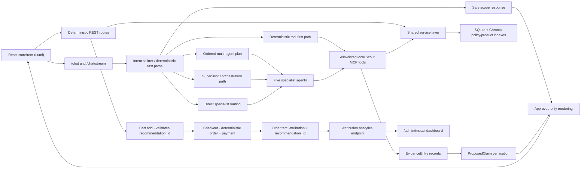

# Scout — Agentic Retail Shopping Assistant

Scout is a multi-agent AI shopping assistant for a retail platform that handles product recommendations, inventory checks, order support, policy questions, and third-party product alternatives through one conversational experience. Instead of relying on a single AI agent to handle everything, Scout uses LangGraph to coordinate five specialized agents — recommendation, inventory, order, policy, and external-offer — with each agent focused on its own responsibility and limited to approved read-only tools.

A major focus of the project is reliability and safety: Scout does not simply generate customer-facing facts such as prices, stock availability, promotions, or order status. Tool results are converted into structured evidence, factual claims are verified against real backend data, and only approved information is shown to the customer. Sensitive commerce operations stay completely outside the autonomous AI system — the agents cannot process payments, modify orders, issue refunds, change inventory, or directly access the database; those actions remain in deterministic backend services and REST APIs.

The guiding rule is simple: **anything that can cost money or trust stays deterministic; the model only helps with language-shaped assistance.**

## Demo Highlights

- **Agentic commerce assistant:** recommendations, inventory checks, store availability, order status, policy Q&A, and external-offer fallback.
- **Portfolio shopping journey:** Scout supports a verified flow from recommendation → size/stock check → cart add → Stripe checkout → order confirmation.
- **Five specialists:** `recommend_agent`, `inventory_agent`, `order_agent`, `external_offer_agent`, and `policy_agent`, built with LangChain `create_agent` and reached through deterministic/direct routing or the Supervisor path when needed.
- **Evidence-backed output:** tool calls produce structured evidence; proposed claims are verified before customer-visible factual replies and product cards are rebuilt from approved claims.
- **Safe commerce boundary:** no checkout, payment, refund, cancellation, SQL, shell, or unrestricted HTTP tool is exposed to specialists. Checkout, inventory reservation, payment finalization, order creation, attribution, and analytics remain deterministic REST/service-layer behavior.
- **Local demo mode:** `ENABLE_STRIPE_MCP=false MODEL_PROVIDER=ollama` starts the app without Stripe MCP discovery while preserving deterministic Stripe REST checkout code.
- **Recommendation-driven revenue tracking:** every recommendation is tagged with a verified `recommendation_id`, carried through cart and checkout, so completed sales can be independently attributed back to Scout — see the internal `/admin/impact` dashboard.
- **Shipment tracking:** authenticated customers can ask about live carrier, status, and estimated delivery for their own orders, with the same read-only-tool and evidence/claims/verification boundary as everything else.
- **Deterministic tool-first path:** clear, unambiguous requests (a specific recommendation, order lookup, or inventory check) bypass the language model entirely and call the appropriate tool directly — removing a real source of non-deterministic behavior for requests that don't need the model's judgment at all.
- **Validated baseline:** 458 backend tests pass, frontend lint/build pass, and a separate behavioral evaluation suite (25 real, live scenarios covering routing, authorization, grounding, latency, and multi-turn conversation state) runs against the live app — see [`docs/evaluation.md`](docs/evaluation.md).

## Architecture At A Glance




See [`docs/architecture.md`](docs/architecture.md) for the detailed flow and [`docs/assets/scout-current-architecture.png`](docs/assets/scout-current-architecture.png) for the full current architecture diagram.

## Portfolio Screenshots

Recommended portfolio captures live in [`docs/screenshots/README.md`](docs/screenshots/README.md). The exported architecture assets are:

- [`docs/assets/scout-portfolio-overview.png`](docs/assets/scout-portfolio-overview.png) — compact portfolio overview.
- [`docs/assets/scout-current-architecture.png`](docs/assets/scout-current-architecture.png) — detailed implementation architecture.

## Tech Stack

| Layer | Technology |
|---|---|
| Frontend | React, Vite, React Router, ESLint |
| Checkout UI | Stripe Elements via `@stripe/react-stripe-js` |
| Backend | FastAPI, Pydantic, SSE |
| Agent orchestration | LangGraph Supervisor + five LangChain `create_agent` specialists |
| Models | Ollama, Claude, Gemini, Groq provider support |
| Tool boundary | MCP local Scout server + code-selected specialist allowlists |
| Data | SQLite locally, Railway/Postgres-ready via `DATABASE_URL`, SQLAlchemy repositories/services |
| Retrieval | Chroma product and policy collections, Ollama `nomic-embed-text` |
| Safety | Evidence schemas, claim verification, approved-only renderer, bounded correction |

## Repository Layout

```text
backend/
  src/scout/
    api/                 FastAPI routes: chat, products, checkout, affiliate, cart add validation
    agents/              Supervisor entry point + specialists, evidence, claims,
                         verification, rendering, and orchestration submodules
                         (see docs/architecture.md for the full breakdown)
    mcp_server/          Local Scout MCP registry: 11 approved read tools
    services/            Deterministic business logic used by REST and tools
    repositories/        Database access layer
    rag/                 Chroma policy/product embedding builders
    db/                  SQLAlchemy models, session, seed data
  tests/                 Deterministic pytest baseline
  tests/eval/            Live evaluation harness and release artifacts
frontend/
  src/                   React storefront, local cart/saved state, chat widget
docs/                    Portfolio, architecture, security, eval, demo docs
```

## Local Setup

### Prerequisites

- Python 3 with `venv`
- Node.js and npm
- Ollama with `qwen3:8b` and `nomic-embed-text`
- Stripe publishable/test secrets only if exercising checkout locally

### Backend

```bash
cd backend
python3 -m venv venv
source venv/bin/activate
pip install -r requirements-dev.txt
python3 src/scout/db/session.py
python3 src/scout/db/seed.py
python3 src/scout/rag/vector_store.py
python3 src/scout/rag/product_embeddings.py
```

For local Ollama demo mode:

```bash
ollama pull qwen3:8b
ollama pull nomic-embed-text
ENABLE_STRIPE_MCP=false MODEL_PROVIDER=ollama \
python -m uvicorn scout.main:app --host 127.0.0.1 --port 8000
```

Copy `backend/.env.example` to `backend/.env` for local secrets. Do not commit real `.env` files.

### Frontend

```bash
cd frontend
npm install
npm run dev
```

The frontend expects the backend on `http://127.0.0.1:8000` for API and product image URLs.

## Live Deployment

Scout is designed to deploy on [Railway](https://railway.app) as coordinated services within a single project:

- **Backend** — FastAPI app built with the root-level `backend.Dockerfile`.
- **Frontend** — React/Vite app built with the root-level `frontend.Dockerfile`.
- **PostgreSQL** — persistent Railway database for orders, checkout records, recommendation feedback, and attribution data.
- **Optional Ollama** — local development model/embedding support. Production chat can use hosted model-provider keys instead of a public Ollama service.

Suggested Railway service settings:

```text
Backend root directory: /
Backend builder: Dockerfile
Backend Dockerfile path: /backend.Dockerfile
Backend watch path: /backend/**

Frontend root directory: /
Frontend builder: Dockerfile
Frontend Dockerfile path: /frontend.Dockerfile
Frontend watch path: /frontend/**
```

The backend container starts with:

```bash
uvicorn scout.main:app --host 0.0.0.0 --port ${PORT:-8000} --app-dir src
```

The frontend container builds the Vite app and serves it with:

```bash
npm run preview -- --host 0.0.0.0 --port ${PORT:-4173}
```

Backend environment variables should be configured in Railway, not committed:

```text
DATABASE_URL=${{ Postgres.DATABASE_URL }}
STRIPE_SECRET_KEY=...
MODEL_PROVIDER=...
ALLOWED_ORIGINS=https://<frontend-domain>
```

Frontend environment variables:

```text
VITE_API_BASE_URL=https://<backend-domain>
VITE_STRIPE_PUBLISHABLE_KEY=...
```

### Railway Database Persistence

SQLite is the local-development default. If a SQLite file lives inside the Railway backend container filesystem, Railway rebuilds can replace that filesystem and reset orders, recommendation feedback, seeded data, and other mutable demo state. That is acceptable for short local demos only if reseeding is expected; it is not production-ready persistence.

For a production-readiness improvement, prefer one of these paths:

1. **Recommended: Railway Postgres**
   - Use Railway's managed Postgres service for persistent application data.
   - Keep SQLite as the local-development and test default.
   - Configure the backend with Railway's `DATABASE_URL` environment variable when deployed. The backend automatically uses SQLite when `DATABASE_URL` is absent and normalizes Railway/Postgres URLs for SQLAlchemy via the `psycopg` driver.
   - Preserve the existing SQLAlchemy repository/service boundary so checkout, order creation, attribution, feedback, and analytics remain deterministic.

   ```text
   DATABASE_URL=${{ Postgres.DATABASE_URL }}
   ```

2. **Demo-only fallback: persistent SQLite volume**
   - Attach a Railway volume and store the SQLite database at a volume-backed path such as `/data/scout.db`.
   - This prevents rebuild resets while keeping the deployment simple.
   - This is less production-like than Postgres and should still be described as a demo persistence option.

Until persistent storage is configured, the Railway SQLite database resets on backend rebuilds and needs reseeding:

```bash
python -m scout.db.seed
python -m scout.db.update_image_urls
```

For a fresh Railway Postgres database, run the deployment initializer once after the backend service has the `DATABASE_URL` variable configured:

```bash
python -m scout.db.init_deployment_data
```

If the private Ollama embedding service is available and you also want to rebuild Chroma policy/product embeddings during initialization, run:

```bash
python -m scout.db.init_deployment_data --rebuild-embeddings
```

Use `--strict-embeddings` only when the deployment should fail if embeddings cannot be regenerated.

Do not commit deployment secrets or real environment files. Configure database URLs, Stripe keys, model-provider keys, and Railway service URLs through Railway environment variables.

## Validation

```bash
cd backend
venv/bin/python -m pytest tests -q

cd ../frontend
npm run lint
npm run build
```

Current baseline:

```text
Backend: 458 tests passing
Frontend: ESLint passing
Frontend: production build passing
```

Live-evaluation methodology and release metrics are summarized in [`docs/evaluation.md`](docs/evaluation.md). Run-specific JSON and log artifacts can be regenerated locally and do not need to be committed for the portfolio demo.

## Demo Flow

Use these as the live demo prompts:

```text
Recommend a dress under $80
Is the Black Midi Dress available in medium?
Do you have a red cocktail dress under $100?
Where is order O1001?
```

Recommended live demo sequence:

| Step | Query | What it proves |
|---|---|---|
| 1 | "Recommend a dress under $80." | Verified Lumi recommendations, prices, promotions, product cards, and recommendation feedback. |
| 2 | "Is the Black Midi Dress available in medium?" | Multi-turn context plus deterministic inventory verification; Scout does not guess stock. |
| 3 | "Is it available in large?" | Follow-up size check keeps the same product/color context. |
| 4 | "Can you add it to my cart?" | Scout adds only the verified size/color variant after explicit confirmation. |
| 5 | Open the cart and checkout | Browser cart state updates; checkout remains deterministic and outside the AI assistant path. |
| 6 | Pay with Stripe test card `4242 4242 4242 4242` | Stripe Elements handles card details; backend finalizes only after payment succeeds. |
| 7 | Order confirmation page | Shows order number, total charged, shipping destination, payment confirmation, and receipt status. |
| 8 | Clear chat, then ask "Do you have a red cocktail dress under $100?" | Honest external fallback when Lumi has no matching internal product. |
| 9 | Click "Compare ..." on external options | External comparison stays external and reminds customers to confirm sizing, shipping, and returns with the outside retailer. |
| 10 | Clear chat, then ask "Where is order O1001?" | Authenticated order + shipment support through read-only backend tools. |

See [`docs/demo-script.md`](docs/demo-script.md) for the full talk track.

## Business Impact

Scout tags every recommended product with a verified `recommendation_id` at the moment it's shown. That ID is carried through cart-add, checkout, and into the persisted `OrderItem` record, so completed sales can be independently attributed back to a specific Scout recommendation — not just claimed, but calculated with a direct, deterministic SQL query:

```
GET /analytics/scout-attributed-revenue
{"scout_assisted_revenue": ..., "scout_assisted_orders": ..., "scout_attributed_items": ...}
```

An internal `/admin/impact` dashboard presents this live. This mirrors how real retail AI teams measure whether an AI assistant investment is actually working — internal business intelligence, never shown to the shopper.

## Evaluation Results

Beyond the deterministic unit/integration test suite, a separate, live-running evaluation suite (`backend/tests/eval/run_eval.py`) exercises the real, deployed API — no mocking — across single-turn, multi-turn, and routing scenarios, plus dedicated authorization, grounding, and latency checks. See [`docs/evaluation.md`](docs/evaluation.md) for full methodology. Representative results from a real run:

| Metric | Result |
|---|---|
| Overall scenarios passed | 25/25 |
| Routing accuracy | 6/6 |
| Authorization blocking rate | 100% (unauthenticated + cross-customer access both blocked; legitimate owner access allowed) |
| Unsupported claims rendered | 0 |
| Conversation success rate | 100% |
| Latency (p50 / p95 / max) | ~1.0s / ~2.4s / ~11-20s (model-dependent) |
| Prompt injection resistance | 5/5 (instruction override, role confusion, false authority, prompt extraction, injected fake instructions) |

## Conversation Behavior

Scout is deliberately user-led, not AI-led. It responds to what the customer asks; it does not steer the conversation toward a purchase or manufacture engagement on its own initiative.

- **Proactive behavior is intentionally limited.** The main exception is the Phase 2 cart offer ("Want me to add the X to your cart?"), which appears only after the customer has already selected or shown interest in a specific product. Scout still requires explicit confirmation before adding anything and never acts unilaterally.
- **Clarifying questions are need-driven, not sales-driven.** Scout asks questions such as "What's your budget?" only when required information is missing from the customer's request. It does not use follow-up questions to steer the customer toward a purchase or manufacture engagement.

Together, these reinforce a core principle: Scout can assist and suggest, but the customer remains in control of the conversation and every meaningful action.

## Safety Claims

- Specialist agents receive only code-selected read tools; no checkout, payment, refund, cancellation, SQL, shell, or unrestricted HTTP tool is exposed to agents.
- Tool calls create sanitized evidence records; customer-visible facts are proposed, verified, and approved before rendering.
- Rejected facts are not edited out of model prose. Final replies and product cards are rebuilt from approved claims.
- Checkout, PaymentIntent creation, order creation, cart add validation, and affiliate redirects remain deterministic FastAPI/service-layer paths.
- Out-of-scope requests return a safe scope response without specialist or tool calls.
- External offers are labeled third-party, use explicit affiliate links, and cannot be added to the Scout cart.

## Known Limits

- Order lookups fail closed without an authenticated customer context (see `docs/security.md`), and a local-only demo sign-in supports testing this — but there is no production-grade RBAC, rate limiting, human escalation, carrier integration, or warehouse integration.
- The current Railway demo uses SQLite without guaranteed persistent storage unless a Railway volume or Postgres service is configured. For production readiness, move mutable app data to Railway Postgres and keep SQLite for local development/tests.
- Chat session history is in-memory; frontend cart/saved state is browser `localStorage`.
- Ollama latency depends heavily on local hardware; release eval should run in isolation.
- The verifier covers explicit Scout-domain claim types; it is not a formal proof system or broad semantic entailment engine.
- External-offer images are allowlisted/seeded demo URLs; retailer CDNs can still be brittle outside the app's control.
