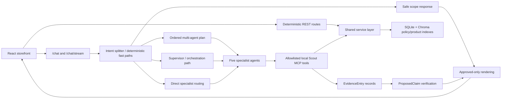

# Scout — Agentic Retail Shopping Assistant

Scout is a full-stack retail demo that pairs a React storefront with a verified multi-agent shopping assistant. The storefront handles browsing, cart state, saved items, and Stripe Elements checkout; the assistant answers shopping questions through a FastAPI + LangGraph backend with code-enforced tool boundaries, structured evidence, deterministic verification, and approved-only rendering.

The guiding rule is simple: **anything that can cost money or trust stays deterministic; the model only helps with language-shaped assistance.**

## Demo Highlights

- **Agentic commerce assistant:** recommendations, inventory checks, store availability, order status, policy Q&A, and external-offer fallback.
- **Five specialists:** `recommend_agent`, `inventory_agent`, `order_agent`, `external_offer_agent`, and `policy_agent`, built with LangChain `create_agent` and reached through deterministic/direct routing or the Supervisor path when needed.
- **Evidence-backed output:** tool calls produce structured evidence; proposed claims are verified before customer-visible factual replies and product cards are rebuilt from approved claims.
- **Safe commerce boundary:** no checkout, payment, refund, cancellation, SQL, shell, or unrestricted HTTP tool is exposed to specialists. Checkout remains a deterministic REST route.
- **Local demo mode:** `ENABLE_STRIPE_MCP=false MODEL_PROVIDER=ollama` starts the app without Stripe MCP discovery while preserving deterministic Stripe REST checkout code.
- **Validated baseline:** 411 deterministic backend tests pass, frontend lint/build pass, and the polished demo flows cover recommendations, inventory, orders, policy, external offers, payment boundaries, and out-of-scope handling.

## Architecture At A Glance




See [`docs/architecture.md`](docs/architecture.md) for the detailed flow and [`docs/assets/scout-current-architecture.png`](docs/assets/scout-current-architecture.png) for the full current architecture diagram.

## Portfolio Screenshots

Recommended portfolio captures live in [`docs/screenshots/README.md`](docs/screenshots/README.md). The exported architecture assets are:

- [`docs/assets/scout-portfolio-overview.png`](docs/assets/scout-portfolio-overview.png) — compact portfolio overview.
- [`docs/assets/scout-current-architecture.png`](docs/assets/scout-current-architecture.png) — detailed implementation architecture.

## Tech Stack

| Layer | Technology |
|---|---|
| Frontend | React, Vite, React Router, ESLint |
| Checkout UI | Stripe Elements via `@stripe/react-stripe-js` |
| Backend | FastAPI, Pydantic, SSE |
| Agent orchestration | LangGraph Supervisor + five LangChain `create_agent` specialists |
| Models | Ollama, Claude, Gemini, Groq provider support |
| Tool boundary | MCP local Scout server + code-selected specialist allowlists |
| Data | SQLite, SQLAlchemy repositories/services |
| Retrieval | Chroma product and policy collections, Ollama `nomic-embed-text` |
| Safety | Evidence schemas, claim verification, approved-only renderer, bounded correction |

## Repository Layout

```text
backend/
  src/scout/
    api/                 FastAPI routes: chat, products, checkout, affiliate, cart add validation
    agents/              Supervisor entry point + specialists, evidence, claims,
                         verification, rendering, and orchestration submodules
                         (see docs/architecture.md for the full breakdown)
    mcp_server/          Local Scout MCP registry: 11 approved read tools
    services/            Deterministic business logic used by REST and tools
    repositories/        Database access layer
    rag/                 Chroma policy/product embedding builders
    db/                  SQLAlchemy models, session, seed data
  tests/                 Deterministic pytest baseline
  tests/eval/            Live evaluation harness and release artifacts
frontend/
  src/                   React storefront, local cart/saved state, chat widget
docs/                    Portfolio, architecture, security, eval, demo docs
```

## Local Setup

### Prerequisites

- Python 3 with `venv`
- Node.js and npm
- Ollama with `qwen3:8b` and `nomic-embed-text`
- Stripe publishable/test secrets only if exercising checkout locally

### Backend

```bash
cd backend
python3 -m venv venv
source venv/bin/activate
pip install -r requirements-dev.txt
python3 src/scout/db/session.py
python3 src/scout/db/seed.py
python3 src/scout/rag/vector_store.py
python3 src/scout/rag/product_embeddings.py
```

For local Ollama demo mode:

```bash
ollama pull qwen3:8b
ollama pull nomic-embed-text
ENABLE_STRIPE_MCP=false MODEL_PROVIDER=ollama \
python -m uvicorn scout.main:app --host 127.0.0.1 --port 8000
```

Copy `backend/.env.example` to `backend/.env` for local secrets. Do not commit real `.env` files.

### Frontend

```bash
cd frontend
npm install
npm run dev
```

The frontend expects the backend on `http://127.0.0.1:8000` for API and product image URLs.

## Validation

```bash
cd backend
venv/bin/python -m pytest tests -q

cd ../frontend
npm run lint
npm run build
```

Live-evaluation methodology and release metrics are summarized in [`docs/evaluation.md`](docs/evaluation.md). Run-specific JSON and log artifacts can be regenerated locally and do not need to be committed for the portfolio demo.

## Demo Flow

Use these as the live demo script:

| Step | Query | What it proves |
|---|---|---|
| 1 | “Recommend a dress under $80.” | Verified recommendations, prices, promotions, and product cards. |
| 2 | “Is the black midi dress in a medium?” | Product/color/size inventory evidence, not product summary fallback. |
| 3 | “Where is order O1001?” | Read-only order lookup without mutation tools. |
| 4 | “Recommend a black dress under $80, check Maple Grove medium availability, and explain opened-item returns.” | Dependent multi-intent orchestration across recommendation, inventory, and policy. |
| 5 | “Do you have any red cocktail dresses under $50?” | Verified internal insufficiency before labeled third-party affiliate offers. |
| 6 | “Can you charge my card and buy this?” | Safe payment boundary: agents cannot charge cards or complete checkout. |
| 7 | “What is the weather today?” | Out-of-scope handling with no specialist/tool call. |

See [`docs/demo-script.md`](docs/demo-script.md) for the full talk track.

## Safety Claims

- Specialist agents receive only code-selected read tools; no checkout, payment, refund, cancellation, SQL, shell, or unrestricted HTTP tool is exposed to agents.
- Tool calls create sanitized evidence records; customer-visible facts are proposed, verified, and approved before rendering.
- Rejected facts are not edited out of model prose. Final replies and product cards are rebuilt from approved claims.
- Checkout, PaymentIntent creation, order creation, cart add validation, and affiliate redirects remain deterministic FastAPI/service-layer paths.
- Out-of-scope requests return a safe scope response without specialist or tool calls.
- External offers are labeled third-party, use explicit affiliate links, and cannot be added to the Scout cart.

## Known Limits

- Order lookups fail closed without an authenticated customer context (see `docs/security.md`), and a local-only demo sign-in supports testing this — but there is no production-grade RBAC, rate limiting, human escalation, carrier integration, or warehouse integration.
- Chat session history is in-memory; frontend cart/saved state is browser `localStorage`.
- Ollama latency depends heavily on local hardware; release eval should run in isolation.
- The verifier covers explicit Scout-domain claim types; it is not a formal proof system or broad semantic entailment engine.
- External-offer images are allowlisted/seeded demo URLs; retailer CDNs can still be brittle outside the app's control.

