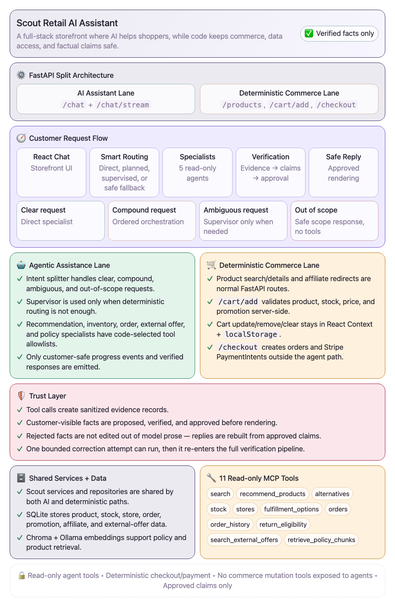
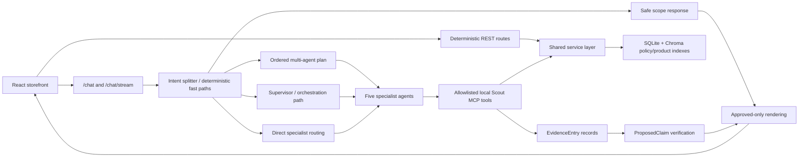

# Scout — Agentic Retail Shopping Assistant

Scout is a multi-agent AI shopping assistant for a retail platform that handles product recommendations, inventory checks, order support, policy questions, and third-party product alternatives through one conversational experience. Instead of relying on a single AI agent to handle everything, Scout uses LangGraph to coordinate five specialized agents — recommendation, inventory, order, policy, and external-offer — with each agent focused on its own responsibility and limited to approved read-only tools.

A major focus of the project is reliability and safety: Scout does not simply generate customer-facing facts such as prices, stock availability, promotions, or order status. Tool results are converted into structured evidence, factual claims are verified against real backend data, and only approved information is shown to the customer. Sensitive commerce operations stay completely outside the autonomous AI system — the agents cannot process payments, modify orders, issue refunds, change inventory, or directly access the database; those actions remain in deterministic backend services and REST APIs.

The guiding rule is simple: **anything that can cost money or trust stays deterministic; the model only helps with language-shaped assistance.**

## Demo Highlights

- **Agentic commerce assistant:** recommendations, inventory checks, store availability, order status, policy Q&A, and external-offer fallback.
- **Five specialists:** `recommend_agent`, `inventory_agent`, `order_agent`, `external_offer_agent`, and `policy_agent`, built with LangChain `create_agent` and reached through deterministic/direct routing or the Supervisor path when needed.
- **Evidence-backed output:** tool calls produce structured evidence; proposed claims are verified before customer-visible factual replies and product cards are rebuilt from approved claims.
- **Safe commerce boundary:** no checkout, payment, refund, cancellation, SQL, shell, or unrestricted HTTP tool is exposed to specialists. Checkout remains a deterministic REST route.
- **Local demo mode:** `ENABLE_STRIPE_MCP=false MODEL_PROVIDER=ollama` starts the app without Stripe MCP discovery while preserving deterministic Stripe REST checkout code.
- **Recommendation-driven revenue tracking:** every recommendation is tagged with a verified `recommendation_id`, carried through cart and checkout, so completed sales can be independently attributed back to Scout — see the internal `/admin/impact` dashboard.
- **Shipment tracking:** authenticated customers can ask about live carrier, status, and estimated delivery for their own orders, with the same read-only-tool and evidence/claims/verification boundary as everything else.
- **Validated baseline:** 412 deterministic backend tests pass, frontend lint/build pass, and a separate behavioral evaluation suite (25 real, live scenarios covering routing, authorization, grounding, latency, and multi-turn conversation state) runs against the live app — see [`docs/evaluation.md`](docs/evaluation.md).

## Architecture At A Glance





See [`docs/architecture.md`](docs/architecture.md) for the detailed flow and [`docs/assets/scout-current-architecture.png`](docs/assets/scout-current-architecture.png) for the full current architecture diagram.

## Portfolio Screenshots

Recommended portfolio captures live in [`docs/screenshots/README.md`](docs/screenshots/README.md). The exported architecture assets are:

- [`docs/assets/scout-portfolio-overview.png`](docs/assets/scout-portfolio-overview.png) — compact portfolio overview.
- [`docs/assets/scout-current-architecture.png`](docs/assets/scout-current-architecture.png) — detailed implementation architecture.

## Tech Stack

| Layer | Technology |
|---|---|
| Frontend | React, Vite, React Router, ESLint |
| Checkout UI | Stripe Elements via `@stripe/react-stripe-js` |
| Backend | FastAPI, Pydantic, SSE |
| Agent orchestration | LangGraph Supervisor + five LangChain `create_agent` specialists |
| Models | Ollama, Claude, Gemini, Groq provider support |
| Tool boundary | MCP local Scout server + code-selected specialist allowlists |
| Data | SQLite, SQLAlchemy repositories/services |
| Retrieval | Chroma product and policy collections, Ollama `nomic-embed-text` |
| Safety | Evidence schemas, claim verification, approved-only renderer, bounded correction |

## Repository Layout

```text
backend/
  src/scout/
    api/                 FastAPI routes: chat, products, checkout, affiliate, cart add validation
    agents/              Supervisor entry point + specialists, evidence, claims,
                         verification, rendering, and orchestration submodules
                         (see docs/architecture.md for the full breakdown)
    mcp_server/          Local Scout MCP registry: 11 approved read tools
    services/            Deterministic business logic used by REST and tools
    repositories/        Database access layer
    rag/                 Chroma policy/product embedding builders
    db/                  SQLAlchemy models, session, seed data
  tests/                 Deterministic pytest baseline
  tests/eval/            Live evaluation harness and release artifacts
frontend/
  src/                   React storefront, local cart/saved state, chat widget
docs/                    Portfolio, architecture, security, eval, demo docs
```

## Local Setup

### Prerequisites

- Python 3 with `venv`
- Node.js and npm
- Ollama with `qwen3:8b` and `nomic-embed-text`
- Stripe publishable/test secrets only if exercising checkout locally

### Backend

```bash
cd backend
python3 -m venv venv
source venv/bin/activate
pip install -r requirements-dev.txt
python3 src/scout/db/session.py
python3 src/scout/db/seed.py
python3 src/scout/rag/vector_store.py
python3 src/scout/rag/product_embeddings.py
```

For local Ollama demo mode:

```bash
ollama pull qwen3:8b
ollama pull nomic-embed-text
ENABLE_STRIPE_MCP=false MODEL_PROVIDER=ollama \
python -m uvicorn scout.main:app --host 127.0.0.1 --port 8000
```

Copy `backend/.env.example` to `backend/.env` for local secrets. Do not commit real `.env` files.

### Frontend

```bash
cd frontend
npm install
npm run dev
```

The frontend expects the backend on `http://127.0.0.1:8000` for API and product image URLs.

## Live Deployment

Scout is deployed on [Railway](https://railway.app) as three coordinated services within a single project:

- **Backend** — FastAPI app, built from `backend.Dockerfile`.
- **Frontend** — React app, built from `frontend.Dockerfile` and served via nginx.
- **Ollama** — a dedicated service running `ollama/ollama:latest`, used only for generating embeddings (product/policy semantic search). Chat reasoning uses `MODEL_PROVIDER=claude` in this deployment; Ollama for chat remains a local-development-only option.

Backend environment variables include the standard `.env.example` settings, plus `OLLAMA_BASE_URL` pointed at the Ollama service's private Railway networking address (`http://<service-name>.railway.internal:11434`) so embeddings resolve correctly without exposing Ollama publicly.

Since the SQLite database is not currently backed by a persistent volume in this deployment, it resets on every backend rebuild and needs reseeding:

```bash
python -m scout.db.seed
python -m scout.db.update_image_urls
```

## Validation

```bash
cd backend
venv/bin/python -m pytest tests -q

cd ../frontend
npm run lint
npm run build
```

Live-evaluation methodology and release metrics are summarized in [`docs/evaluation.md`](docs/evaluation.md). Run-specific JSON and log artifacts can be regenerated locally and do not need to be committed for the portfolio demo.

## Demo Flow

Use these as the live demo script:

| Step | Query | What it proves |
|---|---|---|
| 1 | "Recommend a dress under $80." | Verified recommendations, prices, promotions, and product cards. |
| 2 | "I like the second one." | Natural-language product selection among several shown options. |
| 3 | "Wait, is it available in medium first?" | An interruption doesn't lose context - the correct product is checked, and the pending cart offer survives. |
| 4 | "Yes." | Cart additions only happen on explicit confirmation, never unilaterally. |
| 5 | "Is it available at Maple Grove?" | A second specialist (inventory) takes over seamlessly for store-specific stock. |
| 6 | "Where is order O1001?" (signed in) | Authenticated order + live shipment tracking; unauthenticated/cross-customer requests are blocked. |
| 7 | "Can I return an opened item?" | A third specialist (policy) answers from real policy documents. |
| 8 | "Do you have any red cocktail dresses under $50?" | Verified internal insufficiency before labeled, honest third-party alternatives. |
| 9 | Complete checkout via the storefront UI | Deterministic, non-AI checkout and payment. |
| 10 | Open `/admin/impact` | The completed sale now reflects in real, measured Scout-attributed revenue. |

See [`docs/demo-script.md`](docs/demo-script.md) for the full talk track.

## Business Impact

Scout tags every recommended product with a verified `recommendation_id` at
the moment it's shown. That ID is carried through cart-add, checkout, and
into the persisted `OrderItem` record, so completed sales can be
independently attributed back to a specific Scout recommendation — not
just claimed, but calculated with a direct, deterministic SQL query:
GET /analytics/scout-attributed-revenue
{"scout_assisted_revenue": ..., "scout_assisted_orders": ..., "scout_attributed_items": ...} 
An internal `/admin/impact` dashboard presents this live. This mirrors how
real retail AI teams measure whether an AI assistant investment is actually
working — internal business intelligence, never shown to the shopper.

## Evaluation Results

Beyond the 412 deterministic unit/integration tests, a separate,
live-running evaluation suite (`backend/tests/eval/run_eval.py`) exercises
the real, deployed API — no mocking — across single-turn, multi-turn, and
routing scenarios, plus dedicated authorization, grounding, and latency
checks. See [`docs/evaluation.md`](docs/evaluation.md) for full methodology.
Representative results from a real run:

| Metric | Result |
|---|---|
| Overall scenarios passed | 25/25 |
| Routing accuracy | 6/6 |
| Authorization blocking rate | 100% (unauthenticated + cross-customer access both blocked; legitimate owner access allowed) |
| Unsupported claims rendered | 0 |
| Conversation success rate | 100% |
| Latency (p50 / p95 / max) | ~1.0s / ~2.4s / ~11-20s (model-dependent) |

## Safety Claims

- Specialist agents receive only code-selected read tools; no checkout, payment, refund, cancellation, SQL, shell, or unrestricted HTTP tool is exposed to agents.
- Tool calls create sanitized evidence records; customer-visible facts are proposed, verified, and approved before rendering.
- Rejected facts are not edited out of model prose. Final replies and product cards are rebuilt from approved claims.
- Checkout, PaymentIntent creation, order creation, cart add validation, and affiliate redirects remain deterministic FastAPI/service-layer paths.
- Out-of-scope requests return a safe scope response without specialist or tool calls.
- External offers are labeled third-party, use explicit affiliate links, and cannot be added to the Scout cart.

## Known Limits

- Order lookups fail closed without an authenticated customer context (see `docs/security.md`), and a local-only demo sign-in supports testing this — but there is no production-grade RBAC, rate limiting, human escalation, carrier integration, or warehouse integration.
- Chat session history is in-memory; frontend cart/saved state is browser `localStorage`.
- Ollama latency depends heavily on local hardware; release eval should run in isolation.
- The verifier covers explicit Scout-domain claim types; it is not a formal proof system or broad semantic entailment engine.
- External-offer images are allowlisted/seeded demo URLs; retailer CDNs can still be brittle outside the app's control.

