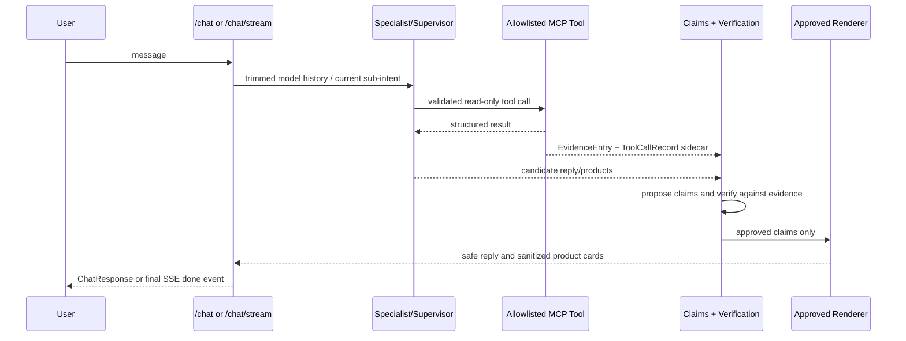

# Scout Architecture

Scout has two lanes: deterministic commerce routes and an agentic assistance route. They share the same service layer so product, order, policy, and checkout facts do not drift between UI and chat paths.

## Request Lanes

### Deterministic commerce lane

- `GET /products`, `GET /products/{id}`, and `GET /products/{id}/similar` serve catalog browsing and product detail pages.
- `POST /checkout` computes server-side prices, creates orders, and uses `payment_service.py` for Stripe PaymentIntent behavior.
- `GET /affiliate/click/{id}` and `GET /affiliate/stats` are deterministic affiliate routes.
- `POST /cart/add` supports deterministic cart-related API behavior.

No LLM or agent tool can mutate checkout/payment/order state.

### Agentic assistance lane

- `POST /chat` and `POST /chat/stream` enter `backend/src/scout/api/chat.py`.
- Both paths use `SESSION_HISTORIES`, an in-memory `dict[str, list[dict]]` keyed by `session_id`.
- `ask()` handles non-streaming execution; `ask_streaming()` handles SSE execution.
- Streaming and non-streaming share the same finalization pipeline: claim proposal, verification, approved-only rendering, price grounding, safety scan, and bounded correction eligibility.
- Out-of-scope requests return a safe scope response without specialist or tool calls.

## Agent Topology

`backend/src/scout/agents/supervisor.py` builds the Supervisor with five specialists from `backend/src/scout/agents/specialists.py`. Each specialist is created through the local `create_specialist_agent()` helper, which wraps LangChain `create_agent` while preserving the current prompts and code-selected tool allowlists.

`supervisor.py` itself is now a thin entry point (~640 lines, down from ~3,360) — most of the actual orchestration logic lives in focused submodules under `agents/`:

- `agents/context/` — conversation memory (product/order/follow-up resolution across turns)
- `agents/routing/` — deterministic specialist selection and out-of-stock recovery routing
- `agents/execution/` — deterministic tool-first execution and model/provider runtime handling
- `agents/verification_flow/` — evidence-completion checks, targeted correction, and finalization
- `agents/orchestration/` — the LangGraph/Supervisor graph factory, turn execution, and multi-intent sequencing
- `agents/comparison.py` — product comparison ranking and rendering

Specialist tool allowlists themselves:

| Specialist | Current tools | Boundary |
|---|---|---|
| `recommend_agent` | `recommend_products`, `search`, `stock`, `alternatives` | Product search, recommendations, similar products, promotions, ranking |
| `inventory_agent` | `search`, `stock`, `stores`, `fulfillment_options` | Inventory, store, fulfillment reads |
| `order_agent` | `orders`, `order_history`, `return_eligibility` | Read-only order information |
| `external_offer_agent` | `search_external_offers` | Third-party offer lookup only |
| `policy_agent` | `retrieve_policy_chunks` | Policy retrieval only |

Single-intent requests often use deterministic fast paths and direct specialist routing. Dependent multi-intent requests use deterministic planning and structured subgoal handoff; ambiguous requests can still enter the Supervisor graph.

## Smart Routing

Routing is intentionally narrower than “everything goes through the Supervisor”:

- Clear single-intent requests route directly to the matching specialist or deterministic tool-first path.
- Supported compound requests become an ordered multi-agent plan, so recommendation can run before inventory/policy when later subgoals depend on selected products.
- Ambiguous requests use the Supervisor / orchestration path. An LLM is used only when deterministic routing is not enough.
- Out-of-scope requests, such as live weather/news, stop at a safe scope response with no specialists or tools.

Contextual follow-up resolution does not preempt supported compound plans. If `detect_supported_compound_intent()` finds a multi-intent plan, Scout preserves the compound request instead of collapsing it into a single follow-up inventory answer.

The current compound planner carries structured values needed for handoff, including selected product IDs, requested size, requested color, requested store, budget, completed subgoals, and pending subgoals. It also recognizes demo phrasing such as “Maple Grove medium availability” and “opened-item returns.”

## Tool Boundary

The local Scout MCP registry in `backend/src/scout/mcp_server/server.py` exposes 11 approved read tools:

`search`, `search_external_offers`, `recommend_products`, `stock`, `alternatives`, `fulfillment_options`, `stores`, `order_history`, `return_eligibility`, `orders`, `retrieve_policy_chunks`.

`MCPToolManager` can optionally load raw Stripe MCP tools when `ENABLE_STRIPE_MCP=true`. Demo/local mode uses `ENABLE_STRIPE_MCP=false`, which avoids Stripe MCP configuration, authorization-header construction, discovery, and network calls. Specialists still receive only code-selected allowlisted Scout tools via `get_tools_by_name()` and `build_specialists()`.

Stripe MCP tools are not used by the five specialist agents. Deterministic checkout remains in REST/service code through `payment_service.py`, so disabling Stripe MCP for local demo mode does not disable Stripe PaymentIntent code.

## Evidence And Verification Pipeline

The renderer rebuilds customer-visible factual content from approved claims. It does not try to redact bad values from model prose. Product cards are sanitized from the same approved claim set.

External Offer Agent runs only after verified internal insufficiency. External product cards are labeled third-party, use explicit affiliate links, do not expose Scout cart actions, and do not inherit Scout return-policy claims unless evidence supports that statement.

## Data And Retrieval

- SQLite stores products, stock, stores, orders, external products, affiliate clicks, and promotions.
- Repository classes own database access; services own business logic.
- `data/chroma/` contains policy embeddings used by `retrieve_policy_chunks`.
- `data/chroma_products/` contains product catalog embeddings used by `recommend_products`.
- Both embedding indexes use Ollama `nomic-embed-text` and must be rebuilt when their source data changes.
- External-offer seed data is treated as a demo catalog. Retailer image URLs are allowlisted/seeded rather than accepted from arbitrary model prose.

## State Model

- Session history is in-memory and not persisted across backend restarts.
- Model input is trimmed to `MAX_HISTORY_MESSAGES` without mutating stored history.
- Structured evidence is a sidecar collector, not appended to LangGraph messages, API responses, SSE payloads, or session history.
- The underlying LangGraph message state remains flat; deterministic continuation code carries specific product/size/store/budget values where needed.

## Cancellation And Timeouts

The backend has configurable model-call, sub-intent, and chat-request deadlines. Timeout paths return safe customer responses, clear evidence collectors in `finally` blocks, avoid raw exception leakage, and prevent abandoned requests from continuing to consume local Ollama resources.
